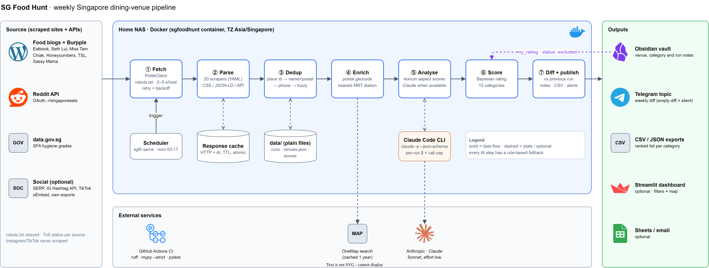

# SG Food Hunt

A self-hosted weekly pipeline that collects Singapore dining venues from food blogs, review sites and open-data APIs, deduplicates them and scores them per occasion (date night, family dinner, zi char, dim sum and 11 more), then publishes ranked lists and week-over-week diffs to an Obsidian vault and a Telegram topic.




<sub>Editable source: [`docs/architecture.drawio`](docs/architecture.drawio) · PNG fallback: [`docs/architecture.png`](docs/architecture.png)</sub>

## Why this exists

A dozen Singapore food blogs, Reddit threads and review sites try to answer "where should we go for a quiet date, or a family zi char dinner, this weekend?" Each covers a slice of the market, goes stale and disagrees with the others. This project does that research once a week. It pulls from every source it's allowed to use, merges sightings of the same outlet, scores each venue per occasion with transparent weights and reports only what changed.

## Highlights

- **Plain files instead of a database.** All state is JSON/JSONL/Markdown under `data/` and the vault. The project runs off a NAS share, where SQLite over SMB/NFS has unreliable file locking, and Obsidian reads Markdown natively. Writes are atomic (temp file + rename, `sgfoodhunt/http/cache.py`), so a crash mid-run never leaves a half-written registry.
- **Polite, compliant scraping by construction.** `sgfoodhunt/http/client.py` checks robots.txt on every fetch. It caches robots.txt for a week and treats a 401/403 on it as "disallow all". It also honours `Crawl-delay` and waits a random 2–5 s per host (`sgfoodhunt/http/ratelimit.py`). Only transient statuses are retried, with jittered exponential backoff. Each source has a `tos_status` in `config/sources.yaml`, and `disallowed` sources (TripAdvisor) never run. Instagram and TikTok are never scraped: data comes only from official APIs, oEmbed or your own data export.
- **Tiered dedup with an audit trail.** `sgfoodhunt/dedup/registry.py` matches sightings in this order:
  1. Google place id
  2. Normalised name + postal code
  3. Shared phone number or booking link (catches renamed or relocated venues)
  4. `rapidfuzz` `token_set_ratio ≥ 88`, only when a postal code is missing

  Venue ids (`v00001…`) stay stable across runs, and every non-exact merge is logged to `merges.jsonl` for review.
- **Explainable scoring, not a black box.** `sgfoodhunt/scoring/score.py` uses a Bayesian-average rating, so 4.9 from 12 reviews doesn't beat 4.6 from 2,000. It also uses recency-decayed recommendations, aspect sentiment and category flags. If a venue has no data for a component, that component is dropped and its weight goes to the others rather than scoring zero. Every weighted component is written to `scores.json` and the venue note, so you can see why a venue ranks where it does.
- **LLM as an optional upgrade with a rule-based fallback.** Four tasks can use AI: Reddit extraction, article extraction, review analysis and social matching. They shell out to `claude -p --json-schema` in `sgfoodhunt/ai/client.py`, so there's no SDK dependency and the output is schema-validated. Answers are cached by prompt hash. Each run is capped by `max_calls_per_run` (200) and `max_budget_usd` (5.0), using the cost the CLI reports. Any failure, timeout or spent budget falls back to the lexicon/regex path, and the pipeline works fully with AI switched off.
- **Human-in-the-loop via Obsidian properties.** Set `status: excluded`, `status: visited` or `my_rating: 4` on a venue note and the next ranking uses it (`(1 − p)·score + p·my_rating/5`). Any `## My …` section is kept when the note is regenerated (`sgfoodhunt/storage/frontmatter.py`).
- **Quiet notifications.** `sgfoodhunt/diff.py` compares each run with the previous one: top-15 entries and exits, rating changes of 0.2 or more, closures, new venues and new sources. `sgfoodhunt/notify.py` posts that diff to a Telegram forum topic. An empty diff sends nothing.
- **Config-driven extension.** A new category is a YAML entry in `config/categories.yaml` with queries, keywords, weights and hard filters. A new WordPress-style blog is usually a regex and a selector in `config/sources.yaml`. Neither needs code changes.

## How it works

The step numbers match the diagram.

1. **Fetch.** The built-in scheduler (`sgfh serve`, default `mon 03:17` SGT) starts a run, so the container doesn't need cron. `PoliteClient` and `AsyncApiClient` run every category query against every enabled source, going through the robots check, rate limiter and response cache.
2. **Parse.** 20 scraper classes (`sgfoodhunt/scrapers/`) turn listicles, result cards (CSS or JSON-LD `Restaurant`) and API responses into raw sightings. These are stored per source as `data/runs/<run_id>/raw/<source>.jsonl`.
3. **Dedup.** Sightings are merged into canonical venues in the persistent registry `data/venues.json`. Low-confidence sources (Reddit, SFA rows) can only attach to a venue another source found; they never create one.
4. **Enrich.** Venues without coordinates are geocoded by postal code through OneMap (cached for a year). The nearest MRT station comes from a bundled station table (`sgfoodhunt/data/mrt_stations.json`).
5. **Analyse.** The stored, anonymised review and article snippets are scored for food, service, ambience and value, plus a noise level and a rating trend. This uses lexicons, or Claude when it's available.
6. **Score.** Each of the 15 categories ranks every venue with its own weights. Bonuses: Michelin, multiple sources, social buzz (capped). Penalties: declining rating trend, poor SFA hygiene grade, temporarily closed.
7. **Diff + publish.** Venue, category and run notes go to the Obsidian vault, and CSV/JSON exports go to `data/exports/<run_id>/`. The diff goes to Telegram, and optionally to email and Google Sheets.

## Tech stack

| Layer | Tech |
| --- | --- |
| Language | Python 3.11, fully typed (`mypy --strict`) |
| CLI | Typer + Rich (`sgfh`) |
| HTTP | requests (static pages), httpx async (APIs), optional Playwright/Chromium |
| Parsing | BeautifulSoup + lxml, JSON-LD |
| Config | YAML validated by Pydantic v2, secrets from `.env` via python-dotenv |
| Matching | rapidfuzz |
| AI (optional) | Claude Code CLI in print mode (`claude -p --json-schema`) |
| Storage | JSON / JSONL / Markdown files, no database |
| Outputs | Obsidian vault, Telegram Bot API, CSV/JSON, SMTP, Google Sheets (gspread), Streamlit + pydeck dashboard |
| Runtime | Docker (python:3.11-slim + Node for the Claude CLI), Docker Compose on a Synology NAS |
| CI | GitHub Actions: ruff, mypy, pytest |

## Getting started

### Prerequisites

- Docker + Docker Compose (on a NAS or any host), or Python 3.11 for a local venv
- Optional: Reddit "script" app credentials, a Telegram bot, and a Claude login or API key

### Configure

```bash
git clone https://github.com/gcjk768/sg-food-hunt.git
cd sg-food-hunt
cp .env.example .env        # .env is git-ignored; never commit it
```

`.env` keys (all optional; if a source's key is missing, the source is skipped and the run note says so):

```dotenv
REDDIT_CLIENT_ID=
REDDIT_CLIENT_SECRET=
REDDIT_USER_AGENT=sgfoodhunt/0.1 by <your_reddit_username>
GOOGLE_PLACES_API_KEY=          # only if you enable google_places in sources.yaml
ANTHROPIC_API_KEY=              # AI layer: one of these two, or log the CLI in
CLAUDE_CODE_OAUTH_TOKEN=
TELEGRAM_BOT_TOKEN=
TELEGRAM_CHAT_ID=               # forum group: -100<chat>
TELEGRAM_THREAD_ID=             # forum topic id
SERP_API_KEY=                   # social module (off by default)
INSTAGRAM_GRAPH_TOKEN=
INSTAGRAM_BUSINESS_ACCOUNT_ID=
SMTP_HOST=
SMTP_PORT=587
SMTP_USER=
SMTP_PASSWORD=
REPORT_EMAIL_TO=
GOOGLE_SHEETS_CREDENTIALS_JSON=
GOOGLE_SHEETS_SPREADSHEET_ID=
```

To turn on Telegram, set `notifications.telegram: true` in `config/settings.yaml`. In `docker-compose.yml`, point the `./vault` volume at your Obsidian vault.

### Run with Docker (NAS)

```bash
docker compose build
docker compose run --rm sgfoodhunt doctor          # paths writable, keys present, schedule valid
docker compose run --rm sgfoodhunt notify-test     # test message to Telegram
docker compose run --rm sgfoodhunt run -c zichar_family -s sethlui   # small live run
docker compose up -d                               # weekly scheduler (SGFH_SCHEDULE)
docker compose run --rm -it sgfoodhunt claude      # one-time Claude CLI login, persisted in ./claude-config
```

The image is stateless:

- `config/`, `data/`, `logs/`, `vault/`, `social_exports/` and `claude-config/` are bind mounts.
- `mem_limit` is 1.5 GB, sized for an 8 GB NAS.
- The healthcheck runs `sgfh doctor --quiet` every five minutes.

### Run locally

```bash
python3.11 -m venv .venv && source .venv/bin/activate
pip install -e ".[dev]"            # extras: browser, dashboard, sheets
sgfh init                          # data/, logs/, vault folder, Home.md, Sources.md
sgfh sources                       # what will run and why
sgfh run                           # collect, dedup, score, write notes and exports
sgfh run --dry-run                 # cached responses only, no network
sgfh rank --offline                # re-score the latest run after changing weights or notes
sgfh runs                          # run history
sgfh show <run_id>                 # per-source counts for one run
sgfh dashboard                     # Streamlit dashboard
```

## Project structure

```
config/                 settings.yaml, categories.yaml (15 categories), sources.yaml (20 sources)
sgfoodhunt/
  cli.py                sgfh entry point (Typer)
  pipeline.py           Collector: runs each category's queries against each source
  http/                 PoliteClient, AsyncApiClient, robots, rate limiting, file cache
  scrapers/             one class per source, registry in __init__.py
  dedup/                venue registry and matching
  enrich/               OneMap geocoding, nearest MRT
  reviews/ ai/          lexicon analysis, Claude CLI client and tasks
  scoring/ ranking.py   per-category scores
  social/               optional buzz module (exports, oEmbed, SERP, hashtag API)
  diff.py notify.py     run-to-run diff, Telegram / email
  reporting/ storage/   vault notes, exports, run store
  dashboard/            Streamlit app
docker/ Dockerfile docker-compose.yml
tests/                  offline tests with saved HTML/JSON fixtures
docs/                   DESIGN.md, architecture diagram, example notes, docs/vault/
```

The full config and storage schema is in [`docs/DESIGN.md`](docs/DESIGN.md).

## Testing & quality

```bash
ruff check . && ruff format --check .
mypy                 # strict, covers sgfoodhunt/ and tests/
pytest -q            # 156 passed locally (2026-09-30); on Windows set PYTHONUTF8=1
```

- Every parser is tested offline against saved fixtures in `tests/fixtures/` (blogs, Burpple, Chope, Michelin, Reddit, SFA, OneMap, social exports). API clients run over an httpx `MockTransport`, so the suite never touches the network.
- End-to-end tests run the collector and ranking against fixtures (`tests/test_pipeline.py`). `tests/test_live_markup.py` holds regression tests built from live-site markup seen on 2026-09-29.
- CI (`.github/workflows/ci.yml`) runs lint, type check and tests on every push.

## Design decisions & limitations

- **Source coverage is deliberately narrow.** Only 9 of the 20 sources are enabled: the six blogs, Burpple, Reddit and SFA. The rest are disabled, with the reason written next to each in `config/sources.yaml` (robots.txt disallows it, bot challenges, JS-only search, or terms of service). Google Places is implemented but switched off because it's a paid API. Until it's turned on, there are no Google ratings, opening hours or business status, and scores use the remaining signals.
- **Scrapers are tested against fixtures, not monitored live.** A site redesign can break selectors. A source that parses nothing logs a warning in the run note instead of failing the run, but nothing alerts anyone.
- **SFA needs a real dataset id.** The placeholder `dataset_id` in `sources.yaml` is skipped until you point it at a current data.gov.sg dataset.
- **Lexicon sentiment is coarse.** Without the AI layer, aspect scores come from keyword lexicons over short snippets.
- **Single-host scheduler.** `sgfh serve` is an in-process loop, which suits one NAS container. `.github/workflows/weekly.yml` can run the same pipeline on GitHub Actions as a backup, but it can't write to the vault on the NAS.
- **PDPA-compliant by design.** Reviewer names, usernames and commenter data are dropped when data comes in. Only ratings, dates and anonymised snippets of up to 300 characters are kept. Summaries are generated, never copied.

The roadmap and ops notes are in the project vault: [`docs/vault/Roadmap.md`](docs/vault/Roadmap.md).

---

<OWNER> · [GitHub](https://github.com/gcjk768)
